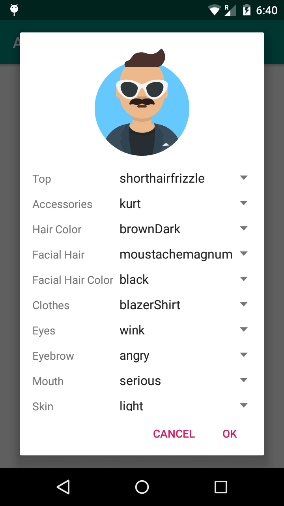

# AvatarPicker
Easily add Avatar picker in your Android application.



## Setup

```
implementation 'com.appsrox:getavatar:1.0.0'
```

## Usage

To show Avatar picker -

```
        AvatarDialog avatarDialog = AvatarDialog.newInstance(avatarUri);
        avatarDialog.show(getSupportFragmentManager(), "fragment_avatar");
```

To get Avatar bitmap -

```
public class MainActivity extends AppCompatActivity implements AvatarDialog.AvatarDialogListener {

    private String avatarUri = null;

    @Override
    public void onAvatarUpdate(String avatarUri, Bitmap avatarBitmap) {
        this.avatarUri = avatarUri;
    }
}
```
